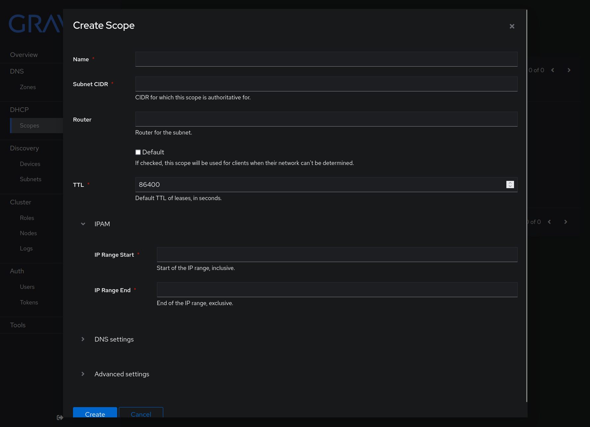

# Setting up Gravity (DHCP + DNS)

We'll now set up our DNS and DHCP service, used for assigning IP addresses to devices on our network and translating domain names to IP addresses.

For this, we'll use a service called [Gravity](https://gravity.beryju.io/), which is excellent because it provides something called High Availability.

## What you'll need
* A working Proxmox cluster

## What is High Availability?
High Availability refers to systems that are designed to withstand the failure of one or more components and continue operating. This is important for a home lab, because we don't want to have to worry about our DNS and DHCP service going down if one of our servers goes down - especially since it provides a network connection for a friend of mine!

## What is Gravity?
Gravity is a "fully replicated DNS and DHCP server" that uses [Raft](https://raft.github.io/) and `etcd` to provide High Availability. It's a great fit for our lab, and it's also very easy to set up.

## Installing Gravity
The first step in installing Gravity is to log into our servers for the first time using something called "SSH".

### What is SSH?
SSH is a protocol that allows you to log into a remote server and execute commands on it. It's lightweight, fast and secure, and is the preferred way to log into Linux servers remotely. It's also the way Ansible will communicate with our servers, allowing us to do things like patch systems and apply security updates, or install new software.

### Logging into your servers
To log into your servers, you'll need to use an SSH client. If you're on Windows, you can install a copy of Ubuntu using something called Windows Subsystem for Linux (WSL or "Whistle"). If you're on Linux or macOS, you can simply open a terminal and use the `ssh` command.

You'll need to know the IP address of your servers. If you don't know them, you can find them in the Proxmox web interface under Datacenter -> Nodes. You'll also need to know the root username and password for each of your servers.

Once you know the IP address, open your terminal or WSL and type the following command:

`ssh-keygen -t ed25519`

When prompted, enter a password that you can remember but that is hard to guess. This will be used to encrypt your SSH key, which is used to log into your servers. Typically a four or five random word password is sufficient.

Once you've done that, you'll need to copy your SSH key to your servers. You can do this by typing the following command:

`ssh-copy-id root@ip-of-server`

It should prompt you for your server's root password. Enter it, and it should copy your SSH key to your server. You can test this by typing the following command:

`ssh root@ip-of-server`

If it asks you for a password, something went wrong. If it logs you in, you're good to go!

:::warning

Logging in as root is not something you should do on a regular basis - or if you can help it, at all. Root is the most powerful account in just about any Linux system, and it's very easy to break things with if you're not careful.

:::

### Installing Docker

:::danger

Installing Docker on top of Proxmox changes the way that Proxmox networking works, and as you can imagine can cause various issues. Heavily modifying the "Debian" side of Proxmox (ie: the base operating system, as opposed to VMs and containers running on top of it) is not usually a good idea. This is NOT recommended as a long term solution - it would be much better to create dedicated VMs or containers with which to run Gravity, which is what we will be migrating to later on. However, as a way of getting things up and running quickly, this is "fine".

:::

The first thing we'll do once we've logged into our new servers is install Docker. Docker is a container runtime that allows us to run software in containers. We'll be using Docker to run Gravity on each of our nodes, and to keep it nice and self-contained.

We'll install Docker the "evil" way - by doing something called **curling to bash**. This is bad, and you shouldn't usually do it, but it's the easiest way to install Docker. If you're curious, you can read more about why it's bad [here](https://sysdig.com/blog/friends-dont-let-friends-curl-bash/).

Open your shell, make sure you're logged into your server, and type the following command:

`curl -fsSL get.docker.com | bash`

This will install, set up and start Docker on your server. Once it's done, you can test it by typing the following command:

`docker ps`

It should print out an empty list of running containers.

### Starting Gravity
Now that we have Docker installed, we can install Gravity. We'll do this by using a tool called `docker-compose`, which allows us to run multiple containers at once. There's actually a variant of Docker Compose built into the main Docker distribution now, which you can use by simply replacing the "-" in `docker-compose` - the command people would usually use - with a space - so, `docker compose`.

To install Gravity, we'll need to create a directory to store our configuration files. We'll do this by typing the following command:

`mkdir /opt/gravity`

Then, we'll create a file called `docker-compose.yml` in that directory. We'll do this by typing the following command:

`editor /opt/gravity/docker-compose.yml`

This will open a text editor, which will most likely be a text editor called `nano`. We'll paste the following into it:

```yaml
---
version: "3.4"

services:
  gravity:
    # Important for this to be static and unique
    hostname: name-of-your-node
    image: ghcr.io/beryju/gravity:stable
    restart: unless-stopped
    network_mode: host
    volumes:
      - data:/data
    # environment:
    #   LOG_LEVEL: info
    # The default log level of info logs DHCP and DNS queries, so ensure
    # the logs aren't filling up the disk
    logging:
      driver: json-file
      options:
        max-size: "10m"
        max-file: "3"

volumes:
  data:
    driver: local
```

Replace the phrase `name-of-your-node` with the name of your node. If you've forgotten, you can find this in the Proxmox web interface under Datacenter -> Nodes.

Once you've done that, save the file and exit the editor. You can do this by hitting Ctrl+X, typing the letter "y", and then hitting Enter/Return.

Then, type the following command:

`cd /opt/gravity && docker compose up -d`

You should now see something like this appear. It may take a few minutes for everything to spin up.


## Logging in
Now that we have Gravity up and running, we'll need to configure it. We have a "single node cluster", which is bad because this also means we have a "single point of failure". 

If our node goes down, our entire DNS and DHCP service goes down with it. Luckily, we're not using Gravity yet - most likely, your router is still providing DNS and DHCP services. We'll "cut over" to the Gravity setup once we've made it *highly available*.

### Visiting your first Gravity node
To visit your first Gravity node, you'll need your IP address again, such as 10.1.1.151.

Navigate to `http://ip-of-your-node:8008` in your web browser. You should see a screen like this:


### Getting your password
The default username is `admin`, but we don't actually know the password yet! We'll need to examine Docker's **logs** to find it.

:::info

Logs are a critical way to determine what servers, clusters, services and various other parts of technology are doing. They give you a pulse on what's happening and are very useful for troubleshooting and debugging. Learning to master logs, logging and monitoring will lead you to become a better engineer.

:::

First, examine what's running on your Docker host by typing the following command:

`docker ps`

You'll see output like this:

```bash
root@monstar:/opt/gravity# docker ps
CONTAINER ID   IMAGE                           COMMAND                  CREATED         STATUS         PORTS     NAMES
e176f2ae34e2   ghcr.io/beryju/gravity:stable   "/bin/gravity server"    9 minutes ago   Up 9 minutes             gravity-gravity-1
```

You'll want to note the "CONTAINER ID" of your Gravity container. In this case, it's `e176f2ae34e2`.

Then, type the following command:

`docker logs e17 2>&1 | grep -B3 -A2 "Password"`

There's a LOT to unpack in this short command, so let's go over it!

`docker`: This is the "executable" or program that we ran, which in this case is just called "docker".

`logs`: This is an *argument* we passed to docker, which tells it to show us the logs of a particular container. In this case, Docker takes that argument and runs a `subcommand` called `logs`.

`e17`: This is another argument, which is passed first to the Docker executable and then to the `logs` subcommand. ("Subcommand" is a pretty nebulous term for this, so don't get too attached to it.) This argument tells Docker which container we want to see the logs for. You'll probably note that we didn't actually need to type `e176f2ae34e2` - we just typed `e17` and Docker knew what we meant. This is because Docker is smart enough to know that `e17` is unique enough to identify a single container. In a system with many running containers, you'll have a harder time writing shorthand for containers, as there might have been more than one "e17" container running - in which case Docker would politely return an error. Neat!

`2>&1`: This is a special bit of syntax that tells the shell to redirect the output of the command to the right of it to the same place as the output of the command to the left of it. In this case, it tells the shell to redirect the "stderr" (standard error) output of the command into the "stdout" (standard out) stream, which is necessary to allow you to be able to run commands like `grep` on the output of the `docker logs` command. Note that this is an argument we are passing to the *shell*, not to Docker!

:::info

**Wait, what's a shell?**

A shell is simply what you've been typing your commands into when you've been executing them. There are various kinds of shells - chances are you're using either one called Bash ("Bourne Again Shell") or zsh ("Z Shell"). There are many others, such as fish, csh, ksh, and so on. They all have their own quirks and features, but they all do the same thing - they allow you to execute commands on your computer.

:::

`|`: This is another special bit of syntax that tells the shell to take the output of the command to the left of it and "pipe" it to the command to the right of it. In this case, it tells the shell to take the output of the `logs` subcommand and pipe it to the `grep` subcommand.

`grep`: Grep is about to be your new best friend if you're unfamiliar with it. It's a command that allows you to search for text in the output of a command. In this case, we're searching for the word "Password" in the output of the `docker logs` command.

`-B3`: This is an argument we're passing to the `grep` command. It tells `grep` to show us the three lines *before* the line that matches our search term.

`-A2`: This is another argument we're passing to the `grep` command. It tells `grep` to show us the two lines *after* the line that matches our search term.

Ultimately, this command takes the logs from our Docker container, searches for the term "Password", and shows us the three lines before and two lines after the line that matches our search term.

It produces the following lovely output:

```
------------------------------------------------------------
Welcome to gravity! An admin user has been created for you.
Username: 'admin'
Password: 'THIS-IS-NOT-MY-REAL-PASSWORD-SORRY-BUT-HAVE-SOME-CAKE'
Open 'http://10.1.1.154:8008/' to start using Gravity!
--------------------------------------------------------------------
```

Now that you've got your password, you can login to Gravity!

You *can* feel free to write down that password, by the way - but best practices indicate that you should always change an initial password as soon as possible to something secure and unique, then store that password in a secure location such as a password manager.

### Logging in for the first time
Enter your username and password, and you'll be presented with Gravity.


Congratulations, you've installed Gravity! Let's configure it.

## Configuring Gravity
### Creating a DNS zone
The first thing we'll do is setup a DNS zone. We'll do this by clicking on the "DNS" tab, then clicking on "Zones", then clicking on "Create".


Once you've clicked Create, you'll be presented with a basic form. For "Name", fill in the domain name you chose earlier, such as `riff.cc`. Do not tick Authoritative unless you've got your own reason to - we'll go over what that means later.


Click Next to move to the next part of the prompt.

Select "Gravity-hosted".


Click through the rest of the prompts, then click Finish.

You'll notice your domain now appears in the list of Zones - click it to view it.


Your DNS zone is configured, but it's empty - it won't do anything particularly useful yet. Let's fix that. Click on the "Create" button to create your first DNS record.


Fill in the form with the following information:

* Hostname: The name of your first Proxmox server, such as "coheed".

* UID: Leave this as 0. This UID number is a special number that allows us to create multiple records with the same hostname, but different values. We'll use this for things like "round robin DNS" later, which you'll learn about in a future section. For now, simply "0" will suffice.

* Type: Select "A". An A record is a simple mapping between a hostname such as `coheed.riff.cc` and an IPv4 address such as `10.1.1.151`.

* Data: Enter the IP address of your first Proxmox server - in my case, 10.1.1.151.

When you're done, it'll look something like this:


Hit Create, and your DNS record will appear. Repeat the process for each of your Proxmox servers, until your current network is fully mapped out.

### Creating a Gravity cluster
Now that we have Gravity up and running, we'll want to create a cluster. This will allow us to have multiple Gravity nodes, which will allow us to have a highly available DNS and DHCP service. If one of our nodes goes down, the other nodes will be able to take over for it.

It'll be a similar process to Proxmox, in a way - but with a Docker Compose style twist.

Click Cluster -> Nodes in the Gravity sidebar to get started.


We want to take our other Proxmox nodes and "join" them to this Gravity cluster. To do so, you'll want to follow the same steps you did to install Gravity on your first node, but with a few changes. Instead of pasting the original `docker-compose.yml` file, we'll use one generated by Gravity itself.

Click on the "Join" button in the Gravity web interface, and you'll be presented with a form. Uncheck the "Debug" box, enter your node's unique name, and click "Next".


Gravity will generate a pre-filled `docker-compose.yml` file for you. Copy the contents of this file, and paste it into your editor. Save it as `docker-compose.yml` in the `/opt/gravity` directory on your node, and then run `docker compose up -d` like you did before.

It'll look something like this:

```
version: "3.4"
services:
  gravity:
    hostname: al
    image: ghcr.io/beryju/gravity:stable
    restart: unless-stopped
    network_mode: host
    user: root
    environment:
      ETCD_JOIN_CLUSTER: <REDACTED-JOIN-TOKEN>,http://10.1.1.154:8008
      BOOTSTRAP_ROLES: dns;dhcp;api;etcd;discovery;monitoring;debug;tsdb
    volumes:
      - data:/data
    logging:
      driver: json-file
      options:
        max-size: 10m
        max-file: "3"
volumes:
  data:
    driver: local
```


Once you've done that, you'll see your node appear in the Gravity web interface.


Repeat this process for each of your nodes, until you have a cluster with all of your nodes in it. You'll need at least 3 for true "quorum", though Gravity *technically* supports (but does NOT recommend) two node clusters through a couple of hacks.

### Creating a DHCP scope
Now that we have a cluster, we can create a DHCP pool. This will allow us to assign IP addresses to devices on our network. As a neat side bonus, Gravity will also keep track of which devices have which IP addresses, and create DNS records for them automatically.

Click on the "DHCP" tab, then click on "Scopes", then click on "Create".

This form will look a *bit* intimidating at first, but we'll go through it.



* Name: Give your scope a name. This can be anything you want, but it's best to make it descriptive. In my case, I've called it "RiffLab".

* Subnet CIDR: CIDR is a shorthand way of describing a network range - a set of IP addresses that make up a network - in a way that's short and easy for humans to understand. You're most likely using a "/24" network - that is, 256 addresses (with 254 usable addresses). If you're using a network of, let's say, 192.168.1.x where X is the address of each computer, enter "192.168.1.0/24" here. In the case of RiffLab, we'll use "10.1.0.0/16" since we're using a /16 network with 65536 addresses (with 65534 usable addresses).

* Router: This is the IP address of your router. In my case, it's 10.1.1.1. Usually (but not always!) the first address in your network range belongs to a router.

* TTL: This is the "Time To Live", in seconds, of your DHCP leases. This is how long a device can keep an IP address before it has to renew it. By default, this is set to 86400 - in other words, one full day - but you can change it to whatever you want. I've set mine to 8 hours - 28,800 seconds.

* IPAM: This section determines how IP addresses are handed out by the new DHCP service.
    
      * IP Range Start: This is the first IP address that will be handed out by the DHCP service. For RiffLab, we'll set it to 10.1.2.2. This allows us to keep 10.1.1.x for static network assets such as our Proxmox nodes, as well as other servers, routers and switches.

      * IP Range End: This is the last IP address that will be handed out by the DHCP service. For RiffLab, we'll set it to 10.1.49.250.

Click the DNS settings section to expand it. Set "DNS Zone" to the DNS zone you created earlier.

Since we're now using a highly available cluster, we'll also want to click the Advanced section and set some DHCP Options, to allow us to tell clients which DNS servers they should be using. This is where it gets a BIT tricky, as you'll need to know the IP addresses of your Gravity nodes - and encode them into something called `base64`.

Gather your three (or more) Gravity node's IP addresses, and run them through this script. You'll want to replace these IP addresses with your nodes, and follow the example.

```
echo -n "10.1.1.151" | awk -F'.' '{ printf "%c%c%c%c", $1, $2, $3, $4 }' | base64
CgEBlw==
echo -n "10.1.1.152" | awk -F'.' '{ printf "%c%c%c%c", $1, $2, $3, $4 }' | base64
CgEBmA==
echo -n "10.1.1.153" | awk -F'.' '{ printf "%c%c%c%c", $1, $2, $3, $4 }' | base64
CgEBmQ==
```

Once you have your base64-encoded strings, you can create your DNS configuration, which will now contain all three of your Gravity nodes. In the event that one of your nodes goes down, your clients will still be able to resolve DNS queries most of the time. (Some clients will still have issues, as they are not "smart" enough to retry DNS queries on another server automatically. Monitoring will help you keep track of when a node is having issues, and avoid reduction in "WAF")

Enter the following into the DHCP Options field, replacing each value64 string with your own base64 encoded values:
```
- tagName: name_server
  value64:
    - CgEBlw==
    - CgEBmA==
    - CgEBmQ==
```

You'll want to take a quick second to go turn off the DHCP server on your router - we're about to create a DHCP server that will take over for it. This is the "cutover" we described earlier.

Now, click Create, and pat yourself on the back. You've just created your first highly available service!