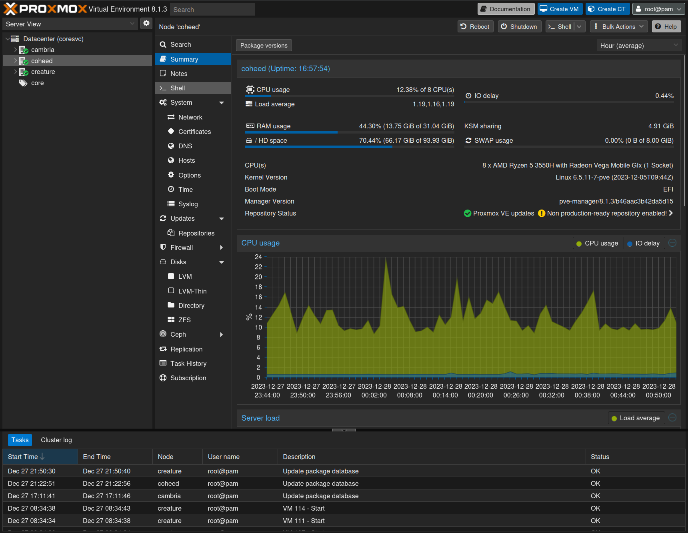

# The first server
Now that we have a basic network up and running, it's time to set up the first **server**.

We're going to jump straight into setting up [Proxmox VE](https://proxmox.com) on a server, one of the core building blocks of our lab. You could also install Ubuntu Server, Debian, Windows, or whatever you felt like.

## What you'll need
* A server to unbox
* A USB thumbdrive, 8GB+ recommended and ideally decent quality

## Unboxing
Whether you're building a server, or purchasing one second hand (or new!), the process is pretty similar. Unpack it, ensure all the necessary components are installed and all the shrink wrap is removed, then plug it in, plug in a monitor and keyboard/mouse, and connect it to your router (We'll add switch(es) later).

## Preparing the thumbdrive
Download a copy of Proxmox VE. You'll want something called an ISO installer, which can be found [here](https://proxmox.com/en/downloads) as of this writing. Once you've downloaded it, copy/"burn" it to a thumbdrive using a utility of your choice - we suggest BalenaEtcher.

Once that's done, plug in your thumbdrive and enter the BIOS/UEFI setup menu. You'll want to select a "boot device" - that'll be your thumbdrive - for the computer to boot from. Pressing F10, F12, or, if you're not sure, "Delete" on your keyboard should bring up a menu that allows you to select your USB thumbdrive. It might show up as "UEFI: proxmox" or something similar. Select it, then hit Enter to boot into the Proxmox installer.

## Installing Proxmox
Follow the prompts carefully to install Proxmox. You'll want to pick an IP address that you'll be able to remember easily, as in these early stages we won't have DNS to help us remember where things are.

Once you're done, you should have a server on the network that you can "talk" to with a web browser or SSH client, and the ability to run virtual machines on your new Proxmox host - which we'll use to set up some of the other infrastructure we need.

### What's in a name?
There are two approaches to naming machines - that of "cattle" and that of "pets".

The pets approach suggests that each machine is special and has a distinct identity tied to that machine. There are many downsides to this approach, which we won't go into much here.

The cattle approach suggests naming machines after what they do, or some other meaningful information.

:::note

Our compromise is simple - physical machines that are likely to stick around get assigned pet names, and virtual machines or deployments that do not have a physical presence are given purpose-related names such as `netbird01` - cattle names. Routers and switches and other networking gear also get cattle names.

## Logging into Proxmox for the first time
Once you've installed Proxmox, you'll want to log into it. Open a web browser and navigate to the IP address you assigned to your Proxmox host, using HTTPS, and port 8006. For example, `https://10.1.1.151:8006/`. You'll be greeted with a login screen. The default username is `root` and the password is the one you set during installation.

## 

### Exploring the panel
Check out the Proxmox panel. Proxmox can be used to create virtual machines, containers, and more. We'll be using it to create those and build our lab, but for now, let's just take a look around.

