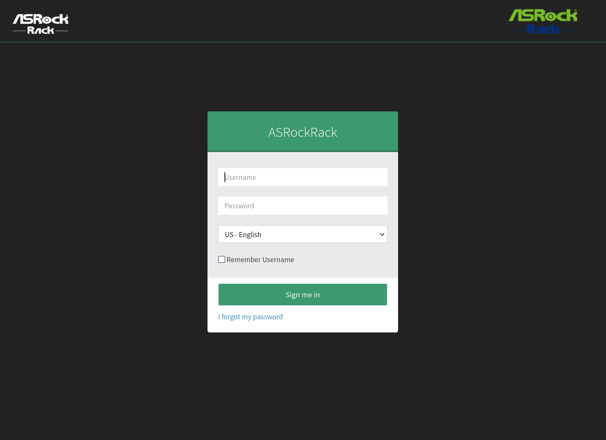
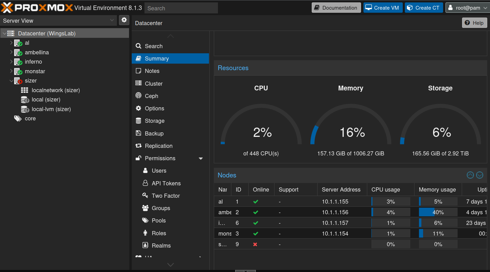

# Your first cluster

Let's assume you went through the previous steps and now are ready to create your first cluster. This is simple enough to do pretty easily!

## Prerequisites
* First server set up with Proxmox VE
* Login credentials for the first server

## Plug in your new servers
You'll need at least three Proxmox servers to form something called "quorum", where at least two out of three nodes agree on the state of a particular cluster. This allows for a cluster to continue operating even if one node goes down. (Two node clusters are "possible", but very much not recommended.)

Plug in your new servers. You can use the same process as you did for the first server.

### But wait, I'm out of network ports!
If your router is a consumer router, it might not have very many network ports. You might not have enough ports to plug all your computers and servers in! This is where a switch comes in handy. A switch is a device that allows you to plug in multiple devices and connect them to the same network. You can get a switch for pretty cheap, and it's a great way to expand your network.

You should aim for a 10gbps or better switch if you can afford it. If you can't, a 1gbps switch will work just fine. If you purchase a 10gbps switch, make sure you also purchase 10gbps network adapters or purchase servers that have built in 10gbps networking to keep things even simpler.

10gbps networking is strongly recommended for things such as Ceph and SeaweedFS, which we'll touch on later.

You'll connect your router to your switch via one of your router's Ethernet ports, and then connect your servers to the switch. You can also connect your desktops and other devices to the switch. This is called a "star" topology, and is the most common way to set up a network.

## Enter, IPMI
IPMI is a protocol that allows you to remotely control a server, even if it's powered off. It's a great way to manage servers remotely, and is a great form of remote management. (There's also Redfish, a newer way to do roughly the same thing, but we won't go into that today).

You'll usually find the IPMI credentials for your servers on the packaging, or on the server itself. Once you've plugged in your servers into both power and networking, you'll find they likely automatically come online via IPMI!

Navigate to your router's DHCP leases section (usually somewhere like http://10.1.1.1 or http://192.168.1.1) and look for the IP addresses of your new servers. You'll want to find a MAC address matching the one that was on your server's label or packaging, and then look for the IP address that was assigned to it. You can then navigate to that IP address in your web browser and log in with the credentials you found on the label or packaging, such as https://10.1.50.1.

Once you've logged in, you'll be greeted with a screen that looks something like this:

## Installing Proxmox, again
Log into the IPMI device for each of your servers and ensure that they're all powered on. If they're not, power them on, and navigate to the "KVM" section of the IPMI interface. You should be able to see the console of your server, and you should also be able to share a local ISO file (your copy of the Proxmox installer) with the remote server, saving you from even having to plug in a thumbdrive!

Follow the same steps you did before to install Proxmox on your new servers. Once you've done that, you'll be ready to create your first cluster. Note that while the installation of a Proxmox cluster is not automated, you'll only have to do it once, and it's a fairly simple process. From here on out, almost everything we plan to do will be largely automated, with the eventual goal of an entirely self-healing cluster. 

We suggest you use the same root password - ideally a secure one such as those generated by a password manager - for all your servers, to make things easier, but if you want to go one step further you can generate unique passwords for each. We'll largely be using something called an `ssh key` to log into our servers, which we'll cover shortly, so you won't actually be using your passwords very often either way.

SSH keys are highly recommended (or SSH certificates, which are even better) for connecting to your servers, as they allow you to log in without a password, and are much more secure than passwords alone, especially when combined with a secret passphrase.

## Creating your first cluster
Go to the web interface for your first node, and under Datacenter -> Cluster, click on Create Cluster and give your new cluster a name.

Then, go to Datacenter -> Cluster, and click on Join Information. Copy the information from the first node into the remaining nodes, and click Join Cluster. Repeat this process for all nodes.

Once you're all done, you'll end up with this - your first Proxmox cluster.

Congratulations! You've just created your first Proxmox cluster. From here on out, we'll be using this cluster to create the rest of our lab.

## Credits
* Images for this page taken from https://pve.proxmox.com/wiki/Cluster_Manager