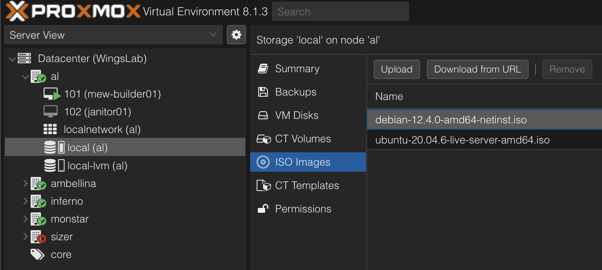
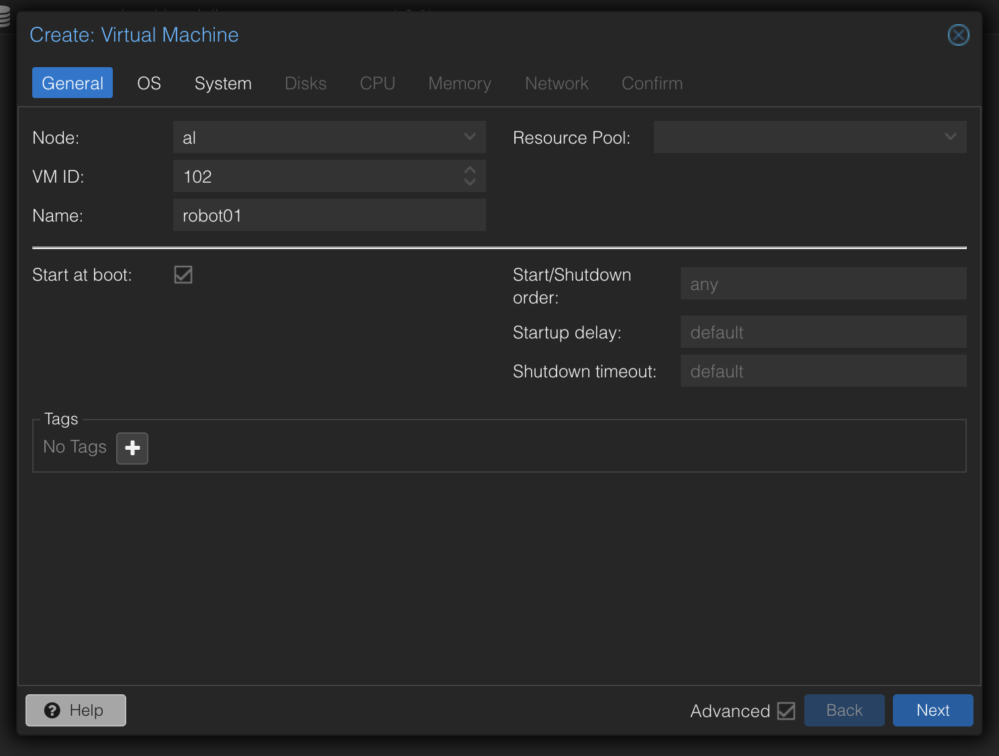
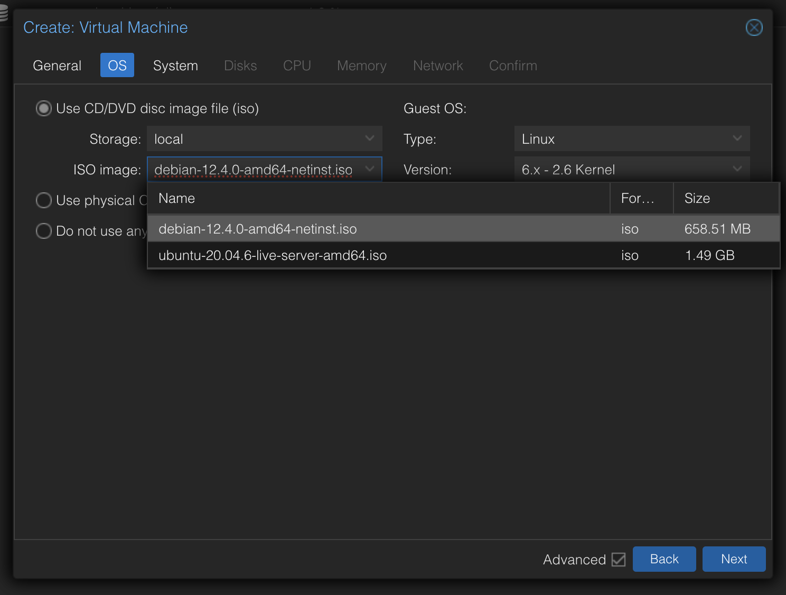
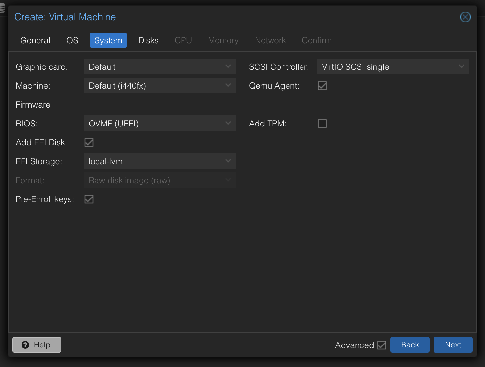
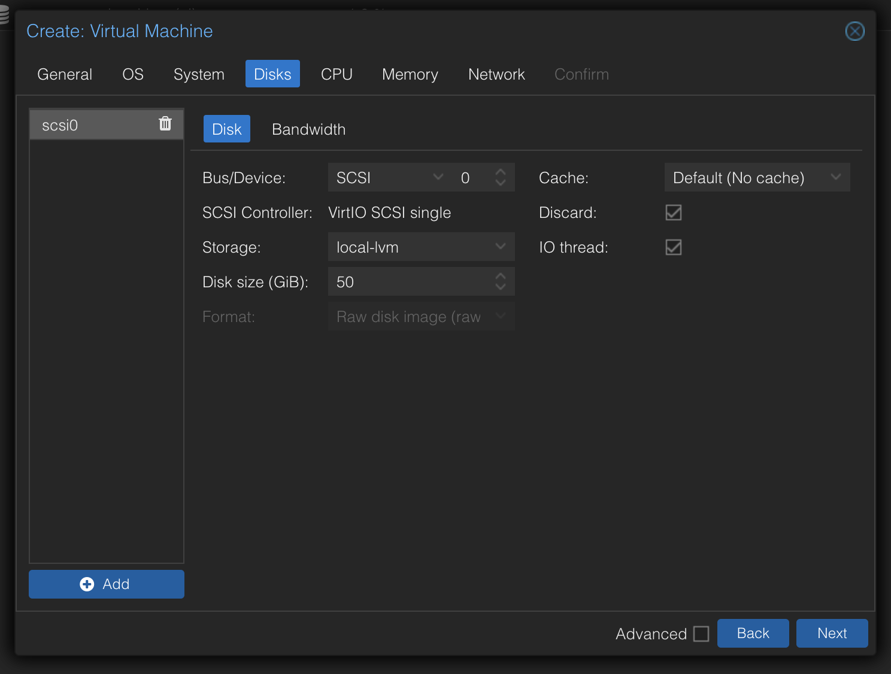
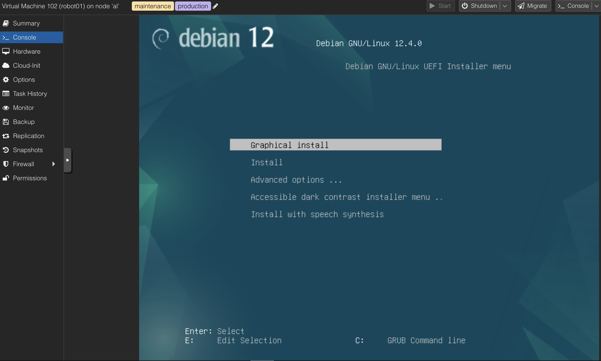

# Your first VM

<!-- TODO - It would be good to flesh out the Debian install settings in this guide one day. -->
Now it's time to create a virtual machine in the Proxmox cluster, which will be the first of many. We'll use this VM to run a few different services, and we'll use it to learn how to manage VMs in Proxmox. We'll also use it as a basic way of testing that our new DHCP and DNS setup is working properly, and that our network is configured correctly in general.

## Creating the VM
Log into the Proxmox web interface. This will be at https://your-node-ip:8006. You'll be presented with a login screen. Enter your username and password, and you'll be taken to the Proxmox dashboard.

### Installation media
First, you'll need some installation media. You'll want to download an ISO for some sort of Linux distribution. For the Riff Lab, we'll go with Debian (and we'll assume going forwards that you are using Debian or Proxmox unless stated otherwise).

### Downloading Debian
Head to the Debian homepage at [https://www.debian.org](https://www.debian.org). Right-click on the big "Download" link and hit "Copy Link Address" or similar. This will copy the download link for Debian to your clipboard, so we can paste it into Proxmox. Go back to your Proxmox tab, click and expand a node, click on a datastore such as `local`, and click `ISO Images` in the middle-left sidebar.

It'll look like this, except yours will start out empty.



Click the 'Download from URL' button at the top of the page. Paste the URL you copied from the Debian website into the box, and hit `Download`. Proxmox will download the ISO and save it to the datastore. This may take a few minutes, depending on your internet connection.

### Creating the VM
Now that we have an ISO, we can create a VM. Click on the `Create VM` button at the top of the page. You'll be presented with a wizard to create a new VM. We'll go through each step of the wizard.

#### General
The first step is the `General` step. Here, you'll enter a name for your VM. We'll call ours `robot01`. You'll also need to select a node to run the VM on. You can select any node you like. Leave the VM ID as whichever ID Proxmox suggests, unless you have your own reason to set a specific number.

Click the Advanced checkbox.

For most workloads, you will want to `Start at boot`, and since you're creating a production machine, select the + icon next to Tags and add the `production` tag. This indicates a VM that is running an important service.



For this first VM, we'll also give it a tag of `maintenance` to indicate that it is a maintenance server. Don't worry, this will be more exciting than it sounds!

Click Next.

#### OS
Select `Use CD/DVD disc image file (iso)` and pick the Debian ISO image from the "ISO Image" dropdown.



#### System
For `System` you'll generally want to make your setting look like the following:



* Graphic card: `Default`
* Machine: `Default (i440fx)`
* Firmware BIOS: `OMVF (UEFI)` (if you're using a modern OS like Debian 11)
* Add EFI Disk: `Yes`
* EFI Storage: `local-lvm` (or `local-zfs` if you're running ZFS, or the name of your distributed storage if you're using that)
* Pre-enroll key: `Yes` (if you are running Debian 12, Ubuntu 20.04 or newer)`
* SCSI Controller: `VirtIO SCSI single` or whatever the default currently is.
* Qemu Agent: `Yes`. This allows Proxmox to communicate with the VM and perform actions like graceful shutdowns and reboots.
* Add TPM: `No`.

Click Next.

#### Disks
In the `Disks` section, you'll pretty much go with the default options. Select a fairly generous disk size, like 50GiB.

Select `Discard`, and leave the Advanced settings alone. SSD emulation may be useful in some very specific circumstances (but you probably don't need it for most workloads).



Click Next.

For CPU, use between four and six cores, and a single socket (this will usually be the kind of configuration you want for a virtual machine). For memory, use 4GiB - which you'll type into Proxmox as `4096` MiB. This is a good starting point for most VMs. You can always add more later, or lower it to a more sensible value if you gave it too much. Select "Host" as your CPU's *Type*. This will allow you to use special CPU features like Nested Virtualisation, which we'll explore later.

:::note

You can't (easily) lower the amount of *storage* provisioned once a machine is created, unlike memory, CPU and other "composable" resources. So, it's better to start with a smaller amount of storage and increase it later if you need to.

Using the Host CPU type is a good idea for most VMs, but be warned that if you run a heterogenous (diverse) environment, such as one with a blend of Intel and AMD CPUs, you may find issues live migrating VMs between hosts. This is because the CPU features available on one host may not be available on another. This is a problem that can be solved by using a CPU type that is common to all hosts, such as `x86-64-v2-AES` - do this for any VMs that absolutely need to be portable.

:::

For the network, use the default settings, which should be something like `vmbr0` and VirtIO as the network adapter model.

Leave MAC address on automatic, and leave the Advanced settings alone.

Click Next one more time, and then click the `Start after created` checkbox before clicking Finish.

### First Boot
Your VM will roar to life. Click its name to open the main details page about it, where you can see its state and various stats about it.


Click the Console tab in the middle left sidebar. You'll be presented with a Debian installer. Go through the installer using your arrow keys, enter button and general keyboard, and install Debian.



You can use the defaults for most things, but skip setting a root password, and instead create a user account.

Give the machine a hostname of `robot01` (or whatever you called it in Proxmox). Set `riff.cc` as the domain name (or whatever your domain name is). 

Use the name of the lab (if your lab) as your username, or `riff` if it's in the riff lab. 

If it's your own user, make sure to use a strong and memorable password (preferably a five or six word password, but at minimum a four word password or equivalent. See [https://xkcd.com/936/](https://xkcd.com/936/) for more information).

If it's a RiffLab machine, use `riff` as the username for the first user on the system, and use the current password from the RiffLab password store. This will change regularly over time.

When prompted to select packages to install:

* If it's a desktop such as a staff desktop or IPMI workstation, select `Debian desktop environment` and select `Cinnamon` (de-selecting GNOME) if this a VM without a GPU (most VMs will not have a GPU) but *does* need a desktop environment. Make sure to select `SSH server` and `standard system utilities` as well.

* If it's a server or container host, simply select `SSH server` and `standard system utilities`.

* If it's a desktop with GPU passthrough, select `Debian desktop environment` and select `KDE`.

Make sure to select `SSH server` and `standard system utilities` as well.

Leave the rest unchecked unless you have a specific reason to install them.

Once you've installed Debian, you'll be presented with a login prompt. Log in with the username and password you created during the installation process.

Once the machine is booted for the first time and you've logged in, select the `Hardware` tab in the middle left sidebar. Double-click CD/DVD Drive (ide2), and click the `Do not use any media` button. This will remove the Debian ISO from the VM's virtual CD drive, and prevent it from booting from the ISO again. Go back to the console.

### Post-installation
First, install some basic utilities we need on pretty much every machine:

```bash
sudo apt update
sudo apt install -y curl wget git nano htop tmux screen
```

:::tip

You should have a keypair (such as `~/.ssh/id_ed25519*`) and passphrase from earlier. If you don't, go back and create one now. You'll need it for the next step. You should also make sure you've added your public key to your GitHub account.

:::

If this is a RiffLab install, install the default set of RiffLab keys by running the following command:

```bash
mkdir -p ~/.ssh
curl -s https://github.com/zorlin.keys > ~/.ssh/authorized_keys
curl -s https://github.com/michatinkers.keys > ~/.ssh/authorized_keys
```

:::tip

If you want to save yourself some typing, use the up and down arrows to select the command you just typed, and left and right and backspace keys to edit it. You can also use the `Ctrl + A` and `Ctrl + E` keys to jump to the start and end of the line respectively. Use these navigation keys cleverly and often to great effect. In the two commands above, it could cut 50+ characters of typing to just twelve.

:::

Log back into Gravity and check out the DHCP Scopes section. Search for your machine's IP address (which you can get with the command `ip a`). Make sure it has a hostname assigned to it - if not, edit the entry and give it a hostname. Click "Turn to reservation` while you're here.

You can now exit the Proxmox interface and log into the machine directly using SSH. While you can use the IP address of the machine to log in, you should get in the habit of using the hostname, which will be `robot01.riff.cc` if you're in the RiffLab, or `robot01.yourdomain.com` if you're in your own lab. You can usually use the short version of the hostname too - just `robot01`.
